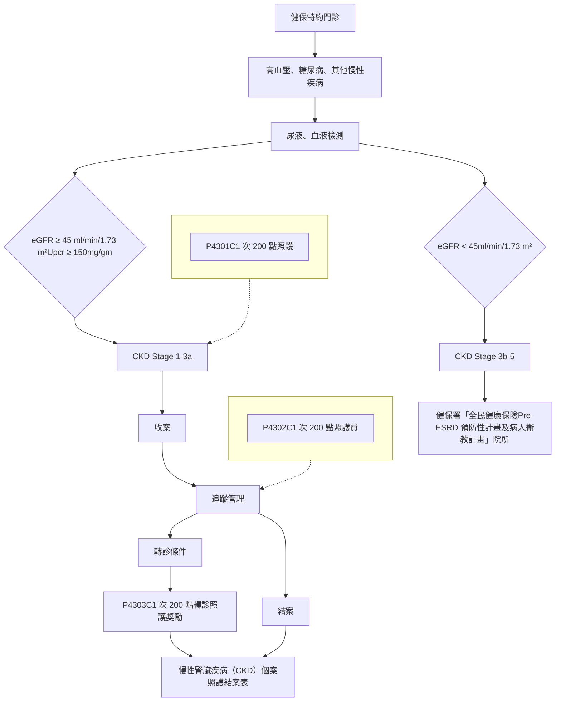

# 第二章 糖尿病及初期慢性腎臟病照護整合方案

## 通則：

一、參與資格：醫事人員及醫事機構，須向保險人之分區業務組申請同意後，始得申報本章費用，申請資格如下：

(一) 糖尿病：醫事機構須組成照護團隊，醫事人員並經地方政府共同照護網認證後向保險人之分區業務組申請同意。

1. 第一階段照護：

(1) 團隊醫事人員資格如下：

A. 醫師、護理衛教及營養衛教之專業人員須經各地方政府糖尿病共同照護網認證合格，地區醫院及基層院所之護理衛教及營養衛教人員，得依相關法規規定以共聘或支援方式辦理。

B. 地區醫院及基層院所團隊醫事人員可為醫師加另一專業人員執行（可包括護理師、營養師、藥師），惟團隊仍需取得各地方政府糖尿病共同照護網醫師、護理衛教及營養衛教認證合格。

(2) 上述參與資格如主管機關有最新規定，從其規定。

2. 第二階段照護：個案完整申報新收案（P1407C）一次、追蹤（P1408C 或 P7001C）至少五次、年度評估（P1409C 或 P7002C）至少二次後，另得視病情需要進行衛教服務，申報第二階段照護項目。

(1) 醫事人員資格如下：限內科、兒科、家醫科、新陳代謝、內分泌、心臟、腎臟專科醫師。除新陳代謝、內分泌、心臟、腎臟專科醫師及原第一階段照護醫師外，其他專科醫師需接受中華民國醫師公會全國聯合會、台灣醫院協會、中華民國糖尿病學會、中華民國糖尿病衛教學會、台灣醫療繼續教育推廣學會或國民健康署公布之糖尿病健康促進機構所主辦之糖尿病相關課程八小時，並取得證明。

(2) 限參與第一階段照護之醫事機構方能提供第二階段照護；第二階段照護醫師名單，須由醫事機構向保險人各分區業務組申請同意。另第一階段照護醫師第一、二階段照護皆可執行。

3. 申報本章糖尿病管理照護費用之醫師，第一階段其當季個案追蹤率小於百分之二十者（指前一季已收案之個案中，於本季完成追蹤者），經輔導未改善，自保險人文到日之次月起，一年內不得再申報本章之相關費用。

(二) 初期慢性腎臟病 (Early Chronic Kidney Disease, Early CKD)：

1. 健保特約院所之腎臟、心臟、新陳代謝專科醫師。

2. 其他專科醫師需接受保險人認可之慢性腎臟病照護訓練，上課時數至少六小時（包含 Early CKD 核心課程及衛教課程，線上或實體均可），並取得證明，且每年得接受繼續教育課程二小時。

3. 設立於山地離島地區之特約院所，具醫師資格且接受保險人認可之慢性腎臟病照護訓練，上課時數至少六小時（包含 Early CKD 核心課程及衛教課程，線上或實體均可），並取得證明，且每年得接受繼續教育課程二小時。

4. 參與之院所與醫師，必須依照本章規定，提供初期慢性腎臟病人完整之治療模式與適當的轉診服務。

5. 參與之醫師，年度追蹤率小於百分之二十者（指前一年度已收案之個案中，於本年度完成追蹤者），經輔導未改善，自保險人文到日之次月起，一年內不得再申報本章之相關費用。

## 二、收案條件：

(一)糖尿病：最近九十天曾在該院所診斷為糖尿病（ICD-10-CM 前三碼為 E08-E13）至少同院所就醫達二次以上者，才可收案，惟當次收案須以主診斷【門診醫療費用點數申報格式點數清單段之國際疾病分類碼（一）】收案。同一院所經結案對象一年內不得再收案，但院所仍可依本支付標準申報相關醫療費用。

## (二)初期慢性腎臟病：

1. 慢性腎臟疾病（Chronic Kidney Disease, CKD）Stage 1、2、3a 期病人，經尿液及血液檢查後，已達下列條件者：

(1)CKD stage 1：腎功能正常但有蛋白尿、血尿等腎臟損傷狀況，腎絲球過濾率估算值（estimated Glomerular filtration rate, 以下稱 eGFR）≧90 ml/min/1.73 m² 且尿蛋白與尿液肌酸酐比值（Urine Protein and Creatinine Ratio，以下稱 UPCR）≧150 mg/gm（或糖尿病病人 UACR≧30 mg/gm）之病人。

(2)CKD stage 2：輕度慢性腎衰竭，併有蛋白尿、血尿等 eGFR 60~89.9 ml/min/1.73 m² 且 UPCR≧150 mg/gm（或糖尿病病人 UACR≧30 mg/gm）之病人。

(3)CKD stage 3a：中度慢性腎衰竭，eGFR 45~59.9 ml/min/1.73 m² 之病人。

2. 收案前九十天內曾在該院所就醫，新收案當次需以「慢性腎臟疾病」為主診斷【門診醫療費用點數申報格式點數清單段之國際疾病分類碼（一）】申報。

(三)糖尿病合併初期慢性腎臟病：於同院所同時由前開糖尿病及初期慢性腎臟病收案之病人，應於病人同一次就診中，完成糖尿病及初期慢性腎臟病追蹤管理照護。

## 三、結案條件：

(一)可歸因於病人者，如長期失聯（糖尿病及糖尿病合併初期慢性腎臟病三個月以上；初期慢性腎臟病一百八十天以上）、拒絕再接受治療、死亡或病人未執行本章管理照護超過一年者等。

(二)經醫師評估已可自行照護者。

(三)初期慢性腎臟病及糖尿病合併初期慢性腎臟病病人，其腎功能持續惡化，Urine protein / creatinine ratio（UPCR）≧1000 mg/gm，或 eGFR＜45 ml/min/1.73 m²，應建議轉診至「全民健康保險末期腎臟病前期（Pre-ESRD）病人照護與衛教計畫」院所。（Stage 3b 或以上）

(四)初期慢性腎臟病病人腎功能改善恢復正常，連續追蹤二次腎功能及蛋白尿並未達慢性腎臟病標準。

## 四、品質資訊之登錄及監測：

(一)特約院所應於健保資訊網服務系統系統(VPN)上傳必要欄位（糖尿病個案詳附表 8.2.9、初期慢性腎臟病個案詳附表 8.2.10、糖尿病合併初期慢性腎臟病個案詳附表 8.2.11）。

(二)特約醫療院所如依「全民健康保險鼓勵醫事服務機構即時查詢病患就醫資訊方案」規定，上傳收案個案之檢驗（查）結果，其值將自動轉入個案登錄系統。

## 五、醫療費用審查：

## (一) 申報原則：

1. 醫療費用申報、暫付、審查及核付，依全民健康保險醫療費用申報與核付及醫療服務審查辦法規定辦理。

2. 門診醫療費用點數申報格式及填表說明：

(1) 屬本章收案之保險對象，符合申報下列醫令者，於申報費用時，應依下列規範申報；未符合申報下列醫令者，依一般費用申報原則辦理。

A. P1407C、P1408C、P1409C、P1410C、P1411C：門診醫療費用點數申報格式點數清單段之案件分類應填『E1』、特定治療項目代號（一）應填『E4』；住院醫療服務點數申報格式點數清單段之給付類別則填寫「C」。

B. P4301C、P4302C、P4303C：門診醫療費用點數清單段之案件分類應填『E1』、特定治療項目代號（一）應填『EB』。

C. P7001C、P7002C：門診醫療費用點數清單段之案件分類應填『E1』、特定治療項目代號（一）應填『EK』。

(2) 申報方式：併當月份送核費用申報。

(二) 審查原則：

1. 未依保險人規定內容登錄相關品質資訊，或經保險人審查發現登載不實者，將不予支付該筆管理照護費並依相關規定辦理；另該筆管理照護費被核刪後不得再申報。

2. 本章規範應於健保資訊網服務系統系統（VPN）登錄之檢驗（查）之任一病人檢驗值經保險人審查發現登載不實，將取消該年度之品質獎勵措施資格，並追扣該年度已核發之品質獎勵點數。如連續二年經保險人審查發現登載不實，自保險人文到日之次月起，二年內不得再申報本章費用。

## 六、品質獎勵措施

### (一) 糖尿病：

1. 門檻指標：以申報本章費用之醫師為計算獎勵之單位，符合下列門檻指標目標值之醫師，方可進入品質卓越及品質進步獎勵之評比對象。

(1) 新收案率：

A. 定義：指當年度符合收案條件（最近九十天曾在該院所診斷為糖尿病（ICD-10-CM 前三碼為 E08-E13）同院所就醫達二次以上之病人）中，排除已被其他醫師收案且未結案或前曾經自己收案的人數後，新被收案的比率。

B. 門檻目標值：醫師新收案率須百分之三十以上，限第一階段照護醫師有申報新收案 P1407C 者。

(2) 收案人數五十人以上。

2. 品質獎勵指標

(1) 個案完整追蹤率：

▶ 定義：

A. 分母：當年度該院所由該醫師收案之所有糖尿病個案，排除第四季新收案之人數。

B. 分子：當年度該院所由該醫師收案符合上述分母條件之個案當中，於當年度該院所完成下列條件者，視為達成追蹤。

(A) 已申報年度評估者（P1409C 或 P1411C），其申報當年度追蹤管理（P1408C 或 P1410C 或 P7001C）次數達三次者。

(B) 已申報新收案者（P1407C），視申報新收案之季別，完成下列追蹤管理次數者，視為達成追蹤。

a. 如為第一季申報新收案，其當年度追蹤管理+年度評估次數達三次者。

b. 如為第二季申報新收案，其當年度追蹤管理次數達二次者。

c. 如為第三季申報新收案，其當年度追蹤管理次數達一次者。

(C) 當年度同時申報新收案（P1407C）及年度評估（P1409C 或 P1411C）者，以申報新收案（P1407C）之季別，依第 B 項之（B）原則辦理。

## (2)HbA1C 控制良率

►定義：

A. 分母：當年度該院所由該醫師收案之所有糖尿病病人數。

B. 分子：分母病人中，其最後一次 HbA1C 檢驗值<7.0%（八十歲以上病人 HbA1c<8.0%）之人數。

## (3)HbA1C 控制不良率

►定義：

A. 分母：當年度該院所由該醫師收案之所有糖尿病病人數。

B. 分子：分母病人中，其最後一次 HbA1C 檢驗值>9.0%之人數。

## (4)HbA1C 進步率

►定義：

A. 分母：由該院所該醫師收案，且當年度及前一年度均有登錄 HbA1C 檢驗值之糖尿病人數。

B. 分子：分母病人中，其當年度最後一次 HbA1C 檢驗值較前一年度最後一次 HbA1C 檢驗值進步達 5%以上（檢驗值成長率≦-5%）之人數。

## (5)LDL 控制良率

►定義：

A. 分母：當年度該院所由該醫師收案之所有糖尿病病人數。

B. 分子：分母病人中，其最後一次 LDL 檢驗值<100mg/dL 之人數。

## (6)LDL 控制不良率

►定義：

A. 分母：當年度該院所由該醫師收案之所有糖尿病病人數。

B. 分子：分母病人中，其最後一次 LDL 檢驗值>130mg/dL 之人數。

## (7)LDL 進步率

►定義：

A. 分母：由該院所該醫師收案，且當年度及前一年度均有登錄 LDL 檢驗值之糖尿病人數。

B. 分子：分母病人中，其當年度最後一次 LDL 檢驗值較前一年度最後一次 LDL

檢驗值進步達 10%以上（檢驗值成長率≦-10%）之人數。

## 3.品質卓越獎

(1)以醫院、診所分組，並再依各醫師新收案率分為二組（以新收案率百分之五十五以下及超過百分之五十五區分），合計共分為四組。

(2)各組依「2.品質獎勵指標」之七項指標比率分別排序（收案完整追蹤率、控制良率及進步率為由高排至低；控制不良率為由低排至高），再將各指標之序別各乘上七分之一後相加重新排序，取排序總和前百分之二十五之醫師，可獲得品質卓越獎。惟當年度新參與方案之醫師，須於次年方得參與品質獎勵評比。

(3)獎勵費用：依該醫師所收個案中達成完整追蹤之個案數，每個個案數支付 1,000 點，當年度新收個案則依完整追蹤季數等比例支付。

►收案人數定義：當年度該院所由該醫師申報新收案（P1407C）或年度評估（P1409C）之病人歸戶數（如個案僅申報追蹤管理，則將無法被歸戶為某醫師所收案之個案；如醫師有兼任情形則會依院所分別歸戶）。

## 4.品質進步獎：

(1)該年度品質卓越獎之得獎醫師以外之醫師，依「2.品質獎勵指標」之七項指標計算品質獎勵進步獎：以前一年度為基準年，當年度之七項品質指標比率與基準年相減，均為進步或持平者，可獲品質進步獎。惟醫師需有全曆年之指標為基準年，始得於基準年後之次年參與品質獎勵進步獎之計算（即醫師需有二個完整全曆年申報本章費用）。

(2)獎勵費用：依該醫師所收個案中達成完整追蹤之個案數，每個個案數支付 500 點，當年度新收個案則依完整追蹤季數等比例支付。

5.品質卓越獎與品質進步獎，合計整體獎勵金額不得超過當年度糖尿病照護管理費用之百分之三十。

## (二)初期慢性腎臟病：

1.獎勵單位：以參與醫師為計算獎勵單位，該醫師照護之初期慢性腎臟病病人當年度內完成二次追蹤管理方得列入。

2.門檻指標：該醫師完整追蹤率百分之五十以上。

►定義：

(1)分母：當年度該院所該醫師收案之所有初期慢性腎臟病病人，排除第四季新收案之人數。

(2)分子：符合上述分母條件之病人當中，於當年度該院所完成下列條件者，視為達成追蹤。

A.當年度未申報新收案者（P4301C），其申報當年度追蹤管理（P4302C）次數達二次者。

B.已申報新收案者（P4301C），視申報新收案之季別，完成下列追蹤管理次數者，視為達成追蹤。

(A)如為第一季申報新收案，其當年度追蹤管理（P4302C）次數應達二次。

(B)如為第二、三季申報新收案，其當年度追蹤管理（P4302C）次數應達一次。

3.品質獎勵指標：病人當年度連續二次追蹤資料皆需達成以下二者之一。

(1)CKD 分期較前一年度最後一次照護時改善（如由 stage 2 改善為 stage 1）。

(2)eGFR 較前一年度最後一次照護時改善（eGFR＞前一年度最後一次檢驗值），且下列良好指標至少需有二項指標由異常改善為正常。

A.血壓控制：由前一年度最後一次照護≧140/90 mmHg 改善為＜130/80 mmHg。

B.糖尿病病人 HbA1c 控制：由前一年度最後一次照護≧7.0%改善為＜7.0%。

C.低密度脂蛋白（LDL）：由前一年度最後一次照護≧130 mg/dl 改善為＜130 mg/dl。

D.戒菸（持續六個月以上無抽菸行為）：由前一年度最後一次照護抽菸改善為戒菸。

4.獎勵費用：符合「門檻指標」之醫師，所照護病人符合上述「品質獎勵指標」(1)或(2)者，每個個案數支付 400 點。

(三)糖尿病合併初期慢性腎臟病：

1.品質獎勵指標：

(1)UACR 控制良率

▶定義：

A.分母：當年度該院所收案之所有糖尿病合併初期慢性腎臟病病人數。

B.分子：分母病人中，其最後一次 UACR 檢驗值<30mg/gm 之人數。

(2)UACR 控制不良率

▶定義：

A.分母：當年度該院所收案之所有糖尿病合併初期慢性腎臟病病人數。

B.分子：分母病人中，其最後一次 UACR 檢驗值＞300mg/gm 之人數。

(3)UACR 進步率

▶定義：

A.分母：由該院所收案，且當年度及前一年度均有登錄 UACR 檢驗值之糖尿病合併初期慢性腎臟病病人數。

B.分子：分母病人中，其當年度最後一次 UACR 檢驗值較前一年度最後一次 UACR 檢驗值進步達 5%以上（檢驗值成長率≦-5%）之人數。

(4)HbA1C 控制良率

▶定義：

A.分母：當年度該院所收案之所有糖尿病合併初期慢性腎臟病病人數。

B.分子：分母病人中，其最後一次 HbA1C 檢驗值<7.0%（八十歲以上病人 HbA1c<8%）之人數。

(5)HbA1C 控制不良率

▶定義：

A.分母：當年度該院所收案之所有糖尿病合併初期慢性腎臟病病人數。

B.分子：分母病人中，其最後一次 HbA1C 檢驗值>9.0%之人數。

(6)HbA1C 進步率

▶定義：

A.分母：由該院所收案，且當年度及前一年度均有登錄 HbA1C 檢驗值之糖尿病合併初期慢性腎臟病人數。

B.分子：分母病人中，其當年度最後一次 HbA1C 檢驗值較前一年度最後一次

HbA1C 檢驗值進步達 5%以上（檢驗值成長率≦-5%）之人數。

(7)LDL 控制良率

►定義：

A.分母：當年度該院所收案之所有糖尿病合併初期慢性腎臟病病人數。

B.分子：分母病人中，其最後一次 LDL 檢驗值<100mg/dL 之人數。

(8)LDL 控制不良率

►定義：

A.分母：當年度該院所收案之所有糖尿病合併初期慢性腎臟病病人數。

B.分子：分母病人中，其最後一次 LDL 檢驗值>130mg/dL 之人數。

(9)LDL 進步率

►定義：

A.分母：由該院所收案，且當年度及前一年度均有登錄 LDL 檢驗值之糖尿病合併初期慢性腎臟病病人數。

B.分子：分母病人中，其當年度最後一次 LDL 檢驗值較前一年度最後一次 LDL 檢驗值進步達 10%以上（檢驗值成長率≦-10%）之人數。

2.獎勵方式：

(1)以醫院、診所分組，依上述各項品質獎勵指標結果排序(良率及進步率為由高排至低，不良率為由低排至高)，再將各指標之序別各乘上九分之一後相加重新排序，取排序總和前百分之三十之院所，依該院所收案個案數，每個個案數支付 1,000 點。

(2)前項獎勵費，應有部分分配予參與方案之醫師及個案管理師等照護團隊人員。

3.參考指標：同時具高血壓病人使用血管收縮素轉化酶抑制劑（ACEI）或血管收縮素受體阻斷劑（ARB）藥物之病人比率。

## (四)胰島素注射獎勵措施：

1.適用對象：因糖尿病主診斷就醫且使用糖尿病藥品（ATC 前三碼為 A10）者，收案及非收案之糖尿病病人皆適用。

2.獎勵方式：按當年度糖尿病病人中新增胰島素注射個案數計算，每新增加一人，獎勵 500 點。

(1)胰島素注射定義為「胰島素注射天數達二十八天以上」。

(2)新增胰島素注射個案數係指「前一年未注射胰島素或注射未達二十八天者」。

# 七、本章之管理照護費用及品質獎勵措施費用來源：

(一)糖尿病、糖尿病合併初期慢性腎臟病及胰島素注射獎勵措施：由全民健康保險醫院總額及西醫基層總額之「醫療給付改善方案」專款項下支應，採浮動點值支付，即先以每點 1 元暫付，年度結束時併同本專款項下各方案計算浮動點值，且每點支付金額不高於 1 元。

(二)初期慢性腎臟病：由全民健康保險其他預算之「腎臟病照護及病人衛教計畫」專款項下支應。該預算先扣除預估之獎勵費用額度後，按季均分，以浮動點值計算管理照護費用，且每點金額不高於 1 元；當季預算若有結餘，則流用至下季；第四季併同獎勵費用進行每點支付金額計算。若全年經費尚有結餘，則進行全年結算，但每點支付金額不高於 1 元。

八、保險人得公開參與本章之特約院所名單及相關醫療品質資訊供民眾參考。糖尿病以及糖尿病合併初期慢性腎臟病並公開各組別每項品質指標第二十五、五十、七十五及一百百分位之指標值。

九、符合本章之個案，若合併其它疾病且分屬本保險其他方案或計畫收案對象時，除依本章支付標準申報外，得再依相關方案或計畫申報費用。

<table>
  <thead>
    <tr>
        <th>編號</th>
        <th>診療項目</th>
        <th>基層院所</th>
        <th>地區醫院</th>
        <th>區域醫院</th>
        <th>醫學中心</th>
        <th>支付點數</th>
    </tr>
  </thead>
  <tbody>
    <tr>
        <td>P1407C</td>
        <td>糖尿病 ─第一階段新收案管理照護費 註：1.照護項目詳附表8.2.1，除檢驗檢查項目外，其費用已內含於本項所訂點數內。 2.地區醫院及基層院所之團隊醫事人員可為醫師加另一專業人員執行。</td>
        <td>v</td>
        <td>v</td>
        <td>v</td>
        <td>v</td>
        <td>650</td>
    </tr>
    <tr>
        <td>P1408C</td>
        <td>─第一階段追蹤管理照護費 註：1.照護項目詳附表8.2.2，除檢驗檢查項目外，其費用已內含於本項所訂點數內。 2.申報新收案後至少須間隔七週才能申報本項，本項每年度最多申報三次，每次間隔至少十週。<mark>若當年度同時有申報P1410C或P7001C，合計最多申報三次。</mark> 3.地區醫院及基層院所之團隊醫事人員如為醫師加另一專業人員執行，則申報點數為本項點數之<mark>百分之八十</mark>。 4.<mark>不得與P7001C同時申報。</mark> 5.進入第二階段管理照護一年內不得再申報第一階段管理照護費P1408C、P1409C。</td>
        <td>v</td>
        <td>v</td>
        <td>v</td>
        <td>v</td>
        <td>200</td>
    </tr>
    <tr>
        <td>P1409C</td>
        <td>─第一階段年度評估管理照護費 註：1.照護項目詳附表8.2.3，除檢驗檢查項目外，其費用已內含於本項所訂點數內。 2.申報追蹤管理照護費後至少間隔十週才能申報本項，本項限執行P1407C、P1408C或<mark>P7001C</mark>追蹤合計達三次以上者始得申報，本項每年度最多申報一次。 3.地區醫院及基層院所之團隊醫事人員如為醫師加另一專業人員執行，則申報點數為本項點數之<mark>百分之八十</mark>。 4.<mark>不得與P7002C同時申報。</mark> 5.進入第二階段管理照護一年內不得再申報第一階段管理照護費P1408C、P1409C。</td>
        <td>v</td>
        <td>v</td>
        <td>v</td>
        <td>v</td>
        <td>800</td>
    </tr>
    <tr>
        <td>P1410C</td>
        <td>─第二階段追蹤管理照護費 註：1.照護項目參考附表8.2.2之檢驗項目，另得視病情需要進行衛教服務。除檢驗檢查項目外，其費用已內含於本項所訂點數內。 2.本項每年度最多申報三次，每次間隔至少十週。<mark>若當年度同時有申報P1408C或P7001C，合計最多申報三次。</mark> 3.<mark>不得與P7001C同時申報。</mark></td>
        <td>v</td>
        <td>v</td>
        <td>v</td>
        <td>v</td>
        <td>100</td>
    </tr>
  </tbody>
</table>

<table>
  <thead>
    <tr>
        <th>編號</th>
        <th>診療項目</th>
        <th>基層院所</th>
        <th>地區醫院</th>
        <th>區域醫院</th>
        <th>醫學中心</th>
        <th>支付點數</th>
    </tr>
  </thead>
  <tbody>
    <tr>
        <td>P1411C</td>
        <td>─第二階段年度評估管理照護費 註：1.照護項目參考附表8.2.3之檢驗項目，另得視病情需要進行衛教服務。除檢驗檢查項目外，其費用已內含於本項所訂點數內。 2.申報追蹤管理照護費後至少間隔十週才能申報本項，本項限執行P1408C、P1410C或P7001C追蹤合計達三次以上者始得申報，本項每年度最多申報一次。 3.不得與P7002C同時申報。</td>
        <td>v</td>
        <td>v</td>
        <td>v</td>
        <td>v</td>
        <td>300</td>
    </tr>
    <tr>
        <td rowspan="3">初期慢性腎臟病 P4301C</td>
        <td>─新收案管理照護費 註：應記錄「新收案個案管理基本資料參考表」(詳附表8.2.5)及檢查、檢驗與衛教情形等資料(詳附表8.2.6)。除檢驗檢查項目外，其費用已內含於本項所訂點數內。</td>
        <td>v</td>
        <td>v</td>
        <td>v</td>
        <td>v</td>
        <td>200</td>
    </tr>
    <tr>
        <td> P4302C</td>
        <td>─追蹤管理照護費 註：1.應記錄追蹤檢查、檢驗與衛教情形等資料(詳附表8.2.6)。除檢驗檢查項目外，其費用已內含於本項所訂點數內。 2.申報新收案管理照護費至少需間隔三個月才能申報本項，本項每年度最多申報二次，每次至少間隔六個月。若當年度同時有申報P7001C，兩者合計最多申報三次。 3.不得與P7001C同時申報。</td>
        <td>v</td>
        <td>v</td>
        <td>v</td>
        <td>v</td>
        <td>200</td>
    </tr>
    <tr>
        <td> P4303C</td>
        <td>─轉診照護獎勵費 註：1.限個案符合轉診條件，並經轉診至參與「全民健康保險末期腎臟病前期(Pre-ESRD)病人照護與衛教計畫」院所，確認該計畫收案後方可申報，每人限申報一次。 2.跨院需填寫「全民健康保險轉診單」(如附表8.2.8，一份留存院所)，並提供患者腎臟功能相關資料(如：初期慢性腎臟病患者追蹤管理紀錄參考表及初期慢性腎臟病患者結案參考表等)予被轉診機構參考。若為院內跨科轉診，則須保留院內轉診單於病歷內，且於腎臟科收案追蹤後方予支付。(鼓勵跨院或跨科轉診，但排除已參加Pre-ESRD計畫同一院所的腎臟科互轉) 3.結案原因為恢復正常、長期失聯(一百八十天以上)、拒絕再接受治療或死亡者，不可申報本項。 4.不得與P7003C同時申報。 5.執行前述及其餘轉診相關事宜，應依全民健康保險轉診實施辦法各項規定辦理。</td>
        <td>v</td>
        <td>v</td>
        <td>v</td>
        <td>v</td>
        <td>200</td>
    </tr>
  </tbody>
</table>

<table>
  <thead>
    <tr>
        <th>編號</th>
        <th>診療項目</th>
        <th>基層院所</th>
        <th>地區醫院</th>
        <th>區域醫院</th>
        <th>醫學中心</th>
        <th>支付點數</th>
    </tr>
  </thead>
  <tbody>
    <tr>
        <td>P7001C</td>
        <td>糖尿病合併初期慢性腎臟病 ─追蹤管理照護費 註：1.院所照護同時於糖尿病及初期慢性腎臟病收案之病人，需於同一次就診完成二項疾病之追蹤管理（照護項目同附表8.2.2及附表8.2.6），並以本項目申報，且當次就診不得再另申報P1408C、P1410C及P4302C。 2.除檢驗檢查項目外，表列照護項目之費用已內含於本項所訂點數內。 3.地區醫院及基層院所之團隊醫事人員如為醫師加另一專業人員執行，則申報點數為本項點數之百分之八十。 4.至少須間隔任一方案之新收案七週後才能申報本項，每年度最多申報三次，每次間隔至少十週。若年度中因個案尚未同時參與同院所糖尿病及初期慢性腎臟病收案照護，有單一疾病追蹤管理者，仍得以該次追蹤管理疾病別申報P1408C(或P1410C)或P4302C，惟每年度分別與本項合計最多申報仍為三次，每次間隔至少十週。</td>
        <td>v</td>
        <td>v</td>
        <td>v</td>
        <td>v</td>
        <td>400</td>
    </tr>
    <tr>
        <td>P7002C</td>
        <td>─年度評估管理照護費 註：1.照護項目同附表8.2.3，除檢驗檢查項目外，其費用已內含於本項所訂點數內。 2.申報任一追蹤管理照護費後至少間隔十週才能申報本項，本項限執行P1407C、P1408C、P1410C、P4301C、P4302C或P7001C合計達三次以上者始得申報，本項每年度最多申報一次。 3.地區醫院及基層院所之團隊醫事人員如為醫師加另一專業人員執行，則申報點數為本項點數之百分之八十。 4.不得與P1409C或P1411C同時申報。</td>
        <td>v</td>
        <td>v</td>
        <td>v</td>
        <td>v</td>
        <td>800</td>
    </tr>
    <tr>
        <td>P7003C</td>
        <td>─轉診照護獎勵費 註：1.限個案符合轉診條件，並經轉診至參與「全民健康保險末期腎臟病前期(Pre-ESRD)病人照護與衛教計畫」院所，確認經該計畫收案後方可申報，每人限申報一次。 2.跨院需填寫「全民健康保險轉診單」(同附表8.2.8，一份留存院所)，並提供患者腎臟功能相關資料(如：初期慢性腎臟病患者追蹤管理紀錄參考表及初期慢性腎臟病患者結案參考表等)予被轉診機構參考。若為院內跨科轉診，則須保留院內轉診單於病歷內，且於腎臟科收案追蹤後方予支付。(鼓勵跨院或跨科轉診，但</td>
        <td>v</td>
        <td>v</td>
        <td>v</td>
        <td>v</td>
        <td>200</td>
    </tr>
  </tbody>
</table>

<table>
  <thead>
    <tr>
        <th>編號</th>
        <th>診療項目</th>
        <th>基層院所</th>
        <th>地區醫院</th>
        <th>區域醫院</th>
        <th>醫學中心</th>
        <th>支付點數</th>
    </tr>
  </thead>
  <tbody>
    <tr>
        <td> </td>
        <td>排除已參加Pre-ESRD計畫同一院所的腎臟科互轉) 3.結案原因為恢復正常、長期失聯(一百八十天以上)、拒絕再接受治療或死亡者，不可申報本項。 4.執行前述及其餘轉診相關事宜，應依全民健康保險轉診實施辦法各項規定辦理。</td>
        <td> </td>
        <td> </td>
        <td> </td>
        <td> </td>
        <td> </td>
    </tr>
  </tbody>
</table>

# 附表 8.2.1 糖尿病新收案診療項目參考表（適用編號 P1407C）

## Components of the initial visit

### 1. 醫療病史（Medical history）

(1) 與診斷關聯之症狀、檢驗室結果 Symptoms, laboratory results related to diagnosis

(2) 營養評估，體重史 Nutritional assessment, weight history

(3) 過去及現在治療計畫 Previous and present treatment plans

A. 藥物 Medications

B. 營養治療 Medical Nutrition Therapy

C. 病人自主管理訓練 Self-management training

D. 血糖自我管理及其使用結果 SMBG and use of results

(4) 現在治療執行方案 Current treatment program

(5) 運動史 Exercise history

(6) 急性併發症 Acute complications

(7) 感染病史 History of infections

(8) 慢性糖尿病併發症 Chronic diabetic complications

(9) 藥物史 Medication history

(10) 家族史 Family history

(11) 冠狀動脈心臟病危險因素 CHD risk factors

(12) 心理社會／經濟因素 Psychosocial/economic factors

(13) 菸酒之使用 Tobacco and alcohol use

### 2. 身體檢查（Physical examination）

(1) 身高與體重 Height and weight

(2) 血壓 Blood pressure

\*(3) 23501C 眼底鏡檢 Ophthalmoscopic examination（視網膜散瞳檢查；散朣劑內含）或 23502C 眼底攝影；惟如由眼科專科醫師執行間接式眼底鏡檢查(23702C)，則不需再執行上述項目。

(4) 甲狀腺觸診 Thyroid palpation

(5) 心臟檢查 Cardiac examination

(6) 脈搏評值 Evaluation of pulses

(7) 足部檢查 Foot examination

(8) 皮膚檢查 Skin examination

(9) 神經學檢查 Neurological examination

(10) 口腔檢查 Oral examination

(11) 性成熟度評估（如屬青春期前後）Sexual maturation (if peripubertal)

### 3. 檢驗室評值（Laboratory evaluation）

※(1) 09005C 空腹血漿葡萄糖或微血管血糖 Fasting plasma glucose or capillary blood sugar

※(2) 09006C 醣化血紅素 HbA1C(符合醣化白蛋白檢驗適應症個案，得以 09139C(醣化白蛋白)替代)

※(3) 空腹血脂 Fasting lipid profile（09001C 總膽固醇 cholesterol, total、09004C 三酸甘油脂 triglyceride(TG)、09043C 高密度脂蛋白膽固醇 HDL cholesterol、09044C 低密度脂蛋白膽固醇 LDL cholesterol）

※(4) 09015C 血清肌酸酐 Serum creatinine

※(5) 09026C 血清麩胺酸丙酮酸轉胺基脢 SGPT (or ALT)

※(6) 06013C 尿液分析（尿生化檢查）Urine biochemistry examination

※(7) 12111C 微量白蛋白

※(8) 09016C 肌酐、尿 Creatinine (U) CRTN

¤ (9) 13007C 細菌培養鑑定檢查（視情況而定）Urine culture (if indicated)

¤ (10) 27004C 甲狀腺刺激素放射免疫分析(第一型病人)TSH (type 1 patients)

¤ (11) 18001C 心電圖(成人) Electrocardiogram (adults)

### 4. 管理計畫（Management Plan）

(1) 短期與長期目標 Short- and long-term goals

(2) 藥物 Medications

(3) 營養治療 Medical nutrition therapy

(4) 生活型態改變 Lifestyle changes

(5) 自主管理教育 Self-management education

(6) 監測接受指導遵循度 Monitoring instructions

\*(7) 年度轉診至眼科專科醫師（視情況而定）Annual referral to eye specialist (if indicated)

(8) 其他專科醫師會診（視情況而定）Specialty consultations (as indicated)

(9) 同意接受持續性支持或追蹤的約定 Agreement on continuing support / follow-up

(10) 協助預約流行感冒疫苗（influenza vaccine）接種（視個別院所情況而定）

### 5. 糖尿病自主管理教育（Diabetes Self-management Education）

(1) 糖尿病自主管理教育（Diabetes Self-management Education, DSME）：由糖尿病人和衛教人員共同參與的一種互動的、整合式及進行中的過程，包括︰a) 個體特殊教育需求的評估；b) 確認個體特殊的糖尿病自主管理目標之設定；c) 依個別的糖尿病自主管理目標進行教育及促進行為改變上的介入；d) 依個別的糖尿病自主管理目標進行評價。

(2) 建議標準如下：

A. 結構面：病歷紀錄應包括：a) 描述糖尿病疾病過程及治療之選項；b) 營養管理之整合；c) 日常身體活動之整合；d) 針對治療效益來利用藥物（必要時）的情形；e) 血糖監測、尿酮（必要時）及運用相關檢驗數據來改善急性合併症之預防、偵測與治療之情形；f) 慢性合併症之預防（由減少危險行為著手）、偵測及治療之情形；g) 生活型態改變—個人問題的診斷；h) 以促進健康為主來設定的目標，及日常生活中問題解決的方式；i) 與日常生活中心理社會調適之整合；j) 懷孕婦女及妊娠性糖尿病的管理（含 preconception care）。

B. 過程面︰病歷紀錄過錄應包括︰個案評估、衛生教育計畫、介入、評價及定期追蹤之情形，並記錄衛教人員、醫師及轉診資源等醫療團隊之整體式照護。

C. 結果面：提供糖尿病自主管理教育的單位或機構，應進行持續性品質改善計畫，以結果面來評估衛生教育之效益及提出品質改善的機會。

# 附表 8.2.2 糖尿病及糖尿病合併初期慢性腎臟病追蹤管理診療項目參考表（適用編號 P1408C、P1410C、P7001C）

## Potential components of continuing care visits

<table>
    <tr>
        <th>1. 醫療病史（Medical history）</th>
        <th>2. 身體檢查（Physical examination）</th>
    </tr>
    <tr>
        <td>(1) 評估治療型態 Assess treatment regimen A. 低或高血糖之頻率／嚴重度 Frequency/severity of hypo-/hyperglycemia B. 自我血糖監測結果 SMBG results C. 病人治療型態之調整 Patient regimen adjustments D. 病人接受專業指導遵循度之問題 Adherence problems E. 生活型態改變 Lifestyle changes F. 併發症的症狀 Symptoms of complications G. 其他醫療疾病 Other medical illness H. 藥物 Medications I. 心理社會方面 Psychosocial issues J. 菸酒之使用 Tobacco and alcohol use</td>
        <td>(1) 每次常規性糖尿病回診 Every regular diabetes visit A. 體重 weight B. 血壓 Blood pressure C. 先前身體檢查之異常點 Previous abnormalities on the physical exam (2) 足部檢查（視情況而定）：足部狀況屬高危險性者需增加檢查次數 Foot examination (if indicated): more often in patients with high-risk foot conditions</td>
    </tr>
</table>
<table>
    <tr>
        <th>3. 檢驗室評值（Laboratory evaluation）</th>
        <th>4. 管理計畫評值（Evaluation of Management Plan）</th>
    </tr>
    <tr>
        <td>※(1) 09006C 糖化血紅素 HbA1C A. 三個月一次為原則，須配合初診及年度檢查的結果追蹤（Quarterly if treatment changes or patient is not meeting goals） B. 如病情穩定一年至少二次（At least twice per year if stable） C. 符合醣化白蛋白檢驗適應症個案，得以 09139C(醣化白蛋白)替代 ※(2) 09005C 空腹血漿葡萄糖或微血管血糖 Fasting plasma glucose or capillary blood sugar</td>
        <td>(1) 短期與長期目標 Short- and long-term goals (2) 藥物 Medications (3) 血糖 Glycemia (4) 低血糖之頻率／嚴重度 Frequency/severity of hypoglycemia (5) 血糖自我管理結果 SMBG results (6) 併發症 Complications (7) 血脂異常之控制 Control of dyslipidemia (8) 血壓 Blood pressure (9) 體重 Weight (10) 營養治療 Medical Nutrition Therapy (11) 運動治療型態 Exercise regimen (12) 病人接受自主管理訓練之遵循度 Adherence to self-management training (13) 轉診之追蹤 Follow-up of referrals (14) 心理社會之調適 Psychosocial adjustment (15) 糖尿病知識 Knowledge of diabetes (16) 自主管理技能 Self-management skills (17) 戒菸（若為抽菸者）Smoking cessation, if indicated (18) 協助預約流行感冒疫苗（influenza vaccine）接種（視個別院所情況而定）</td>
    </tr>
</table>
<table>
    <tr>
        <th>5. 糖尿病自主管理教育</th>
        <th>（Diabetes Self-management Education）</th>
    </tr>
    <tr>
        <td>建議標準如下： A. 結構面：按前次照護結果做追蹤應付，病歷紀錄應包括：a)描述糖尿病疾病過程及治療之選項；b)營養管理之整合；c)日常身體活動之整合；d)針對治療效益來利用藥物（必要時）的情形；e)血糖監測、尿酮（必要時）及運用相關檢驗數據來改善急性合併症之預防、偵測與治療之情形；f)慢性合併症之預防（由減少危險行為著手）、偵測及治療之情形；g)生活型態改變—個人問題的診斷；h)以促進健康為主來設定的目標，及日常生活中問題解決的方式；i)與日常生活中心理社會調適之整合；j)懷孕婦女及妊娠性糖尿病的管理（含 preconception care）。 B. 過程面︰病歷紀錄應包括︰個案評估、衛生教育計畫、介入、評價及追蹤之情形，並記錄衛教人員、醫師及轉診資源等醫療團隊之整體式照護。 C. 結果面：提供糖尿病自主管理教育的單位或機構，應進行持續性品質改善計畫，以結果面來評估衛生教育之效益及提出品質改善的機會。</td>
        <td></td>
    </tr>
</table>

註：
1. 參照中華民國糖尿病學會「2010 糖尿病臨床照護指引」。
2. 表列檢驗及服務項目中，「※」及「＊」註記表示為診療指引建議必要執行診療項目。
3. 本表所列項目除有「※」、「＊」註記項目得另行核實申報費用以外，餘均內含於 P1408C、P1410C 及 P7001C 所訂費用之內，不得另行重複申報。

# 附表 8.2.3 糖尿病及糖尿病合併初期慢性腎臟病年度檢查診療項目參考表（適用編號 P1409C、P1411C、P7002C）

## Potential components of continuing care visits (annual exam)

### 1. 醫療病史 (Medical history)

(1) 評估治療型態 Assess treatment regimen

- A. 低或高血糖之頻率／嚴重度 Frequency/severity of hypo-/hyperglycemia

- B. 自我血糖監測結果 SMBG results

- C. 病人治療型態之調整 Patient regimen adjustments

- D. 病人接受專業指導遵循度之問題 Adherence problems

- E. 生活型態改變 Lifestyle changes

- F. 併發症的症狀 Symptoms of complications

- G. 其他醫療疾病 Other medical illness

- H. 藥物 Medications

- I. 心理社會方面 Psychosocial issues

- J. 菸酒之使用 Tobacco and alcohol use

### 3. 檢驗室評值 (Laboratory evaluation)

※(1) 09006C 糖化血紅素 HbA1C (符合醣化白蛋白檢驗適應症個案，得以 09139C (醣化白蛋白) 替代)

※(2) 09005C 空腹血漿葡萄糖或微血管血糖 Fasting plasma glucose or capillary blood sugar

※(3) 年度空腹血脂 Fasting lipid profile annually, unless low risk (09001C 總膽固醇 cholesterol, total、09004C 三酸甘油脂 triglyceride(TG)、09043C 高密度脂蛋白膽固醇 HDL、09044C 低密度脂蛋白膽固醇 LDL cholesterol)

※(4) 09015C 血清肌酸酐 Serum creatinine

※(5) 09026C 血清麩胺酸丙酮酸轉胺基脢 SGPT (or ALT)

※(6) 06013C 尿液分析（尿生化檢查） Urine biochemistry examination

※(7) 12111C 微量白蛋白 Microalbumin (Nephelometry)

※(8) 09016C 肌酐、尿 Creatinine (U) CRTN

¤(9) 18001C 心電圖(成人) Electrocardiogram (adults)

### 2. 身體檢查 (Physical examination)

(1) 年度身體檢查 Physical examination annually

＊(2) 23501C 年度散瞳眼睛檢查 Dilated eye examination annually 或 23502C 眼底攝影；惟如由眼科專科醫師執行間接式眼底鏡檢查(23702C)，則不需再執行上述項目。

(3) 每次常規性糖尿病回診 Every regular diabetes visit

- A. 體重 weight

- B. 血壓 Blood pressure

- C. 先前身體檢查之異常點 Previous abnormalities on the physical exam

(4) 年度足部檢查：足部狀況屬高危險性者需增加檢查次數 Foot examination annually; more often in patients with high-risk foot conditions

### 4. 管理計畫評值 (Evaluation of Management Plan)

(1) 短期與長期目標 Short- and long-term goals

(2) 藥物 Medications

(3) 血糖 Glycemia

(4) 低血糖之頻率／嚴重度 Frequency/severity of hypoglycemia

(5) 血糖自我管理結果 SMBG results

(6) 併發症 Complications

(7) 血脂異常之控制 Control of dyslipidemia

(8) 血壓 Blood pressure

(9) 體重 Weight

(10) 營養治療 Medical Nutrition Therapy

(11) 運動治療型態 Exercise regimen

(12) 病人接受自主管理訓練之遵循度 Adherence to self-management training

(13) 轉診之追蹤 Follow-up of referrals

(14) 心理社會之調適 Psychosocial adjustment

(15) 糖尿病知識 Knowledge of diabetes

(16) 自主管理技能 Self-management skills

(17) 戒菸（若為抽菸者） Smoking cessation, if indicated

(18) 協助預約流行感冒疫苗 (influenza vaccine) 接種（視個別院所情況而定）

### 5. 糖尿病自主管理教育 (Diabetes Self-management Education)

建議標準如下：

- A. 結構面：按前次照護結果做追蹤應對，病歷紀錄應包括：a)描述糖尿病疾病過程及治療之選項；b)營養管理之整合；c)日常身體活動之整合；d)針對治療效益來利用藥物（必要時）的情形；e)血糖監測、尿酮（必要時）及運用相關檢驗數據來改善急性合併症之預防、偵測與治療之情形；f)慢性合併症之預防（由減少危險行為著手）、偵測及治療之情形；g)生活型態改變—個人問題的診斷；h)以促進健康為主來設定的目標，及日常生活中問題解決的方式；i)與日常生活中心理社會調適之整合；j)懷孕婦女及妊娠性糖尿病的管理（含 preconception care）。

- B. 過程面︰病歷紀錄應包括︰個案評估、衛生教育計畫、介入、評價及追蹤之情形，並記錄衛教人員、醫師及轉診資源等醫療團隊之整體式照護。

- C. 結果面：提供糖尿病自主管理教育的單位或機構，應進行持續性品質改善計畫，以結果面來評估衛生教育之效益及提出品質改善的機會。

註：

1. 參照中華民國糖尿病學會「2010 糖尿病臨床照護指引」。

2. 表列檢驗、檢查與服務項目中，「※」及「＊」註記表示為診療指引建議必要執行診療項目，「¤」註記表示為診療指引建議得視病人病情（if indicated）為選擇性執行項目。

3. 本表所列項目除有「※」、「＊」及「¤」註記項目得另行核實申報費用以外，餘均內含於 P1409C、P1411C 及 P7002C 所訂費用之內，不得另行重複申報。

# 附表 8.2.4 初期慢性腎臟疾病個案管理

## 一、慢性腎臟疾病(CKD)之分期：

<table>
  <thead>
    <tr>
        <th>分期</th>
        <th>描述</th>
        <th>估計腎絲球過濾率(eGFR)</th>
    </tr>
  </thead>
  <tbody>
    <tr>
        <td>Stage 1</td>
        <td>腎絲球過濾率正常或增加，但有 蛋白尿、血尿等腎臟損傷狀況</td>
        <td>≧90 ml/min/1.73m²</td>
    </tr>
    <tr>
        <td>Stage 2</td>
        <td>腎絲球過濾率輕微下降， 併有蛋白尿、血尿等狀況</td>
        <td>60-89.9 ml/min/1.73m²</td>
    </tr>
    <tr>
        <td rowspan="3">Stage 3</td>
        <td rowspan="3">腎絲球過濾率中等程度下降</td>
        <td>30-59.9 ml/min/1.73m²</td>
    </tr>
    <tr>
        <td>45-59.9 ml/min/1.73m²</td>
    </tr>
    <tr>
        <td>30-44.9 ml/min/1.73m²</td>
    </tr>
    <tr>
        <td>Stage 4</td>
        <td>腎絲球過濾率嚴重下降</td>
        <td>15-29.9 ml/min/1.73m²</td>
    </tr>
    <tr>
        <td>Stage 5</td>
        <td>腎臟衰竭</td>
        <td>&#x3C;15 ml/min/1.73m²</td>
    </tr>
  </tbody>
</table>

註:1.慢性腎臟疾病(CKD)分類中，腎傷害或腎絲球過濾率下降需持續大於三個月以上

2.腎臟損傷指有影像學變化(如腎萎縮)或傷害指標(如蛋白尿、血尿等)

## 二、慢性腎臟疾病之篩檢

1.對於高危險群應定期檢查血中肌酸酐值及尿液(UPCR 或 UACR)

2.高危險群：

(A)高血壓、高血糖患者

(B)長期服用藥物者

(C)心血管疾病患者

(D)結構性腎小管異常，腎結石或攝護腺腫大者

(E)洗腎家族史或家族性腎疾病

(F)潛在影響腎功能之系統性疾病(如 SLE)

(G)長期食用中草藥者

(H)隨機性血尿或尿蛋白

(I)年紀六十一歲以上

# 三、慢性腎臟疾病管理流程

> **尿液、血液檢測必要項目**
> 1. Urine Protein
> 2. Urine creatinine
> 3. Serum creatinine
> 4. LDL
> 5. HbA1c(%)（DM 必要）

**收案**

1. 新收案個案管理基本資料表
2. 慢性腎臟疾病（CKD）個案追蹤管理照護記錄表

**追蹤管理**

慢性腎臟疾病（CKD）個案追蹤管理照護記錄表

**轉診條件**

\* Urine protein / creatinine ratio（Upcr）≥ 1000 mg/gm。
\* eGFR < 45 ml/min/1.73 m²。

**結案**

1. Upcr ≥ 1000 mg/gm，或 eGFR < 45 ml/min/1.73 m²，應建議轉診至辦理「全民健康保險 Pre-ESRD 病人照護與衛教計畫」院所。

2. 腎功能改善恢復正常。可歸因於病人者，如長期失聯（≥ 180 天）、拒絕再接受治療或死亡等。

**Stage 1-3a 收案條件**

**CKD stage1：**

腎功能正常但有蛋白尿、血尿等腎臟損傷狀況 eGFR ≥ 90ml/min/1.73 m² + Upcr ≥ 150mg/gm(或糖尿病患者 Uacr ≥ 30mg/gm)之各種疾病病患。

**CKD stage2：**

輕度慢性腎衰竭，併有蛋白尿、血尿等 eGFR 60~89.9ml/min/1.73 m² + Upcr ≥ 150mg/gm(或糖尿病患者 Uacr ≥ 30mg/gm)之各種疾病病患。

**CKD stage3a：**

中度慢性腎衰竭，eGFR 45~59.9ml/min/1.73 m²之各種疾病病患。

# 四、初期慢性腎臟疾病照護之衛教內容

Stage 1：腎功能正常但有蛋白尿、血尿等腎臟損傷狀況 eGFR：≧90 ml/min/1.73 m²，建議每六個月追蹤一次
Stage 2：輕度慢性腎衰竭，併有蛋白尿、血尿等 eGFR：60~89.9 ml/min/1.73 m²，建議每六個月追蹤一次
Stage 3a：中度慢性腎衰竭，eGFR：45~59.9ml/min/1.73 m²，建議每六個月追蹤一次
Stage 3b：中度慢性腎衰竭，eGFR：30~44.9 ml/min/1.73 m²，建議每三個月追蹤一次

<table>
  <thead>
    <tr>
        <th>目標</th>
        <th>衛教指導項目</th>
    </tr>
  </thead>
  <tbody>
    <tr>
        <td>● 認識腎臟的構造與功能</td>
        <td>1.認識腎臟的基本構造與功能</td>
    </tr>
    <tr>
        <td>● 認識腎臟疾病常見的症狀及檢查值</td>
        <td>2.簡介腎臟疾病常見症狀及檢查值</td>
    </tr>
    <tr>
        <td>● 如何預防腎臟疾病及其惡化，請勿擅自服食藥物</td>
        <td>3.腎臟病日常生活保健與預防</td>
    </tr>
    <tr>
        <td> </td>
        <td>4.教導定期追蹤之重要性</td>
    </tr>
    <tr>
        <td>● 願意配合定期門診追蹤</td>
        <td>5.教導服用藥物(包括中草藥及健康食品)前，須先徵詢醫師意見</td>
    </tr>
    <tr>
        <td colspan="2">● 願意接受定期護理指導計劃方案</td>
    </tr>
    <tr>
        <td>● 認識腎臟穿刺之必要性(UPCR＞2,000 mg/gm 者)及轉診腎臟專科醫師</td>
        <td>6.腎臟穿刺切片檢查之介紹(UPCR＞2,000 mg/gm 者)及轉診腎臟專科醫師</td>
    </tr>
    <tr>
        <td>● 認識高血脂、高血壓、糖尿病與腎臟病之相關性</td>
        <td>7.簡介高血壓及其併發症</td>
    </tr>
    <tr>
        <td> </td>
        <td>8.簡介高血脂及其併發症</td>
    </tr>
    <tr>
        <td>● 血壓、血糖、血糖、體重、腰圍與 BMI 之控制</td>
        <td>9.簡介糖尿病及其併發症</td>
    </tr>
    <tr>
        <td> </td>
        <td>10.飲食原則之指導(含衛教單張發放)</td>
    </tr>
  </tbody>
</table>

# 附表 8.2.5 初期慢性腎臟病新收案個案管理基本資料參考表（適用編號 P4301C）

* **收案編號**：    

* **病歷號碼**：    

* **姓名**：    

* **身分證字號**：    

* **性別**：[ ] 1.男 [ ] 2.女
* **生日 西元**：     年      月      日
* **年齡**：    

* **收案日期：西元**：     年      月      日

* **聯絡電話**：(      )      (      )     

* **通訊地址**：     縣、市      區鄉市鎮      村.里      路.街      段      巷      弄      號      樓

* **教育程度**：[ ] 1.不識字 [ ] 2.小學 [ ] 3.初中 [ ] 4.高中（職） [ ] 5.大專（學）以上

* **職業**：[ ] 1.退休 [ ] 2.農 [ ] 3.軍公教 [ ] 4.工 [ ] 5.商 [ ] 6.服務業 [ ] 7.家管 [ ] 8.無 [ ] 9.其它

* **家族史（若有親人有罹患右側表列中疾病，請填入家屬代碼）**：
    - [ ] 1.無
    - [ ] 2.糖尿病【      】
    - [ ] 3.高血壓【      】
    - [ ] 4.心臟病【      】
    - [ ] 5.腦血管病變（中風）【      】
    - [ ] 6.高血脂【      】
    - [ ] 7.腎臟病或尿毒症【      】
    - [ ] 8.惡性腫瘤【      】
    - [ ] 9.遺傳性腎臟疾病【      】
    - [ ] 10.多囊腎【      】
    - [ ] 11.痛風【      】
    - [ ] 12.自體免疫性疾病【      】
    - [ ] 13.其他【      】
    - [ ] 14.不知
    - **家屬代碼**：A.父 B.母 C.兒女 D.兄弟姊妹 E.父系親戚 F.母系親戚 G.其他

## 個人健康評估

* **伴隨系統性疾病**：[ ] 無

<table>
  <thead>
    <tr>
        <th>病名</th>
        <th>初次診斷時間</th>
        <th>病名</th>
        <th>初次診斷時間</th>
    </tr>
  </thead>
  <tbody>
    <tr>
        <td>[ ] 1.高血壓</td>
        <td>     年      月      日</td>
        <td>[ ] 18.視力衰退</td>
        <td>     年      月      日</td>
    </tr>
    <tr>
        <td>[ ] 2.糖尿病</td>
        <td>     年      月      日</td>
        <td>[ ] 19.視網膜病變</td>
        <td>     年      月      日</td>
    </tr>
    <tr>
        <td>[ ] 3.腎臟病</td>
        <td>     年      月      日</td>
        <td>[ ] 20.B型肝炎</td>
        <td>     年      月      日</td>
    </tr>
    <tr>
        <td>[ ] 4.缺血性心臟病</td>
        <td>     年      月      日</td>
        <td>[ ] 21.C型肝炎</td>
        <td>     年      月      日</td>
    </tr>
    <tr>
        <td>[ ] 5.心律不整</td>
        <td>     年      月      日</td>
        <td>[ ] 22.慢性肝疾病／肝硬化</td>
        <td>     年      月      日</td>
    </tr>
    <tr>
        <td>[ ] 6.心臟衰竭</td>
        <td>     年      月      日</td>
        <td>[ ] 23.結核</td>
        <td>     年      月      日</td>
    </tr>
    <tr>
        <td>[ ] 7.腦血管疾病</td>
        <td>     年      月      日</td>
        <td>[ ] 24.甲狀腺腫</td>
        <td>     年      月      日</td>
    </tr>
    <tr>
        <td>[ ] 8.腫瘤</td>
        <td>     年      月      日</td>
        <td>[ ] 25.癲癇</td>
        <td>     年      月      日</td>
    </tr>
    <tr>
        <td>[ ] 9.貧血</td>
        <td>     年      月      日</td>
        <td>[ ] 26.精神疾病</td>
        <td>     年      月      日</td>
    </tr>
    <tr>
        <td>[ ] 10.關節炎</td>
        <td>     年      月      日</td>
        <td>[ ] 27.攝護腺肥大</td>
        <td>     年      月      日</td>
    </tr>
    <tr>
        <td>[ ] 11.高膽固醇血症</td>
        <td>     年      月      日</td>
        <td>[ ] 28.皮膚病</td>
        <td>     年      月      日</td>
    </tr>
    <tr>
        <td>[ ] 12.痛風或高尿酸血症</td>
        <td>     年      月      日</td>
        <td>[ ] 29.良性腫瘤</td>
        <td>     年      月      日</td>
    </tr>
    <tr>
        <td>[ ] 13.過敏性鼻炎</td>
        <td>     年      月      日</td>
        <td>[ ] 30.惡性腫瘤</td>
        <td>     年      月      日</td>
    </tr>
    <tr>
        <td>[ ] 14.氣喘</td>
        <td>     年      月      日</td>
        <td>[ ] 31.神經病變</td>
        <td>     年      月      日</td>
    </tr>
    <tr>
        <td>[ ] 15.慢性肺疾病</td>
        <td>     年      月      日</td>
        <td>[ ] 32.自體免疫疾病</td>
        <td>     年      月      日</td>
    </tr>
    <tr>
        <td>[ ] 16.消化性潰瘍</td>
        <td>     年      月      日</td>
        <td>[ ] 33.其他</td>
        <td>     年      月      日</td>
    </tr>
    <tr>
        <td>[ ] 17.功能性腸胃問題</td>
        <td>     年      月      日</td>
        <td>[ ] 34.藥物過敏 藥物名：</td>
        <td>    </td>
    </tr>
  </tbody>
</table>

* [ ] 35.食物過敏 食物名稱：

**危險因子**
- [ ] 1. 血壓高(130/85 以上) 

- [ ] 2. 蛋白尿 

- [ ] 3. 高血脂(TG>150) 

- [ ] 4. 低白蛋白血症 

- [ ] 5. 高血糖(AC>100) 

- [ ] 6. 肥胖(BMI) 

- [ ] 7. 懷孕 

- **抽煙**： 

    - [ ] 1. 無 

    - [ ] 2. 有 

 持續每日：      年      支/每日 

    - [ ] 3. 戒煙      年 

- **喝酒**： 

    - [ ] 1. 無 

    - [ ] 2. 有 

 持續：      年 

    - [ ] 3. 交際應酬 

    - [ ] 4. 成癮 

    - [ ] 5. 習慣性 

      CC／每日 

    - [ ] 6. 戒酒      年 

- **檳榔**： 

    - [ ] 1. 無 

    - [ ] 2. 有 

 持續      年      粒／每日 

    - [ ] 3. 戒檳榔      年 

**平時用藥習慣**
- [ ] 1. 處方用藥 

- [ ] 2. 中醫（中醫師處方） 

- [ ] 3. 傳統草藥（無醫師處方） 

- [ ] 4. 成藥 

- [ ] 5. 提神飲料      

- [ ] 6. 偏方 

- [ ] 7. 健康食品      

- [ ] 8. 口服止痛劑 

- [ ] 9. 針劑止痛劑 

- [ ] 10. 使用不明藥物 

- [ ] 11. 其他      

**健康知識與態度**
1. **如患慢性疾病是否按時就醫**： 

    - [ ] a. 是 

    - [ ] b. 否，原因      

2. **請問您是否覺得體重與慢性疾病有相關？** 

    - [ ] a. 否 

    - [ ] b. 是
3. **請問您是否瞭解慢性疾病與飲食生活習慣有相關？** 

    - [ ] a. 否 

    - [ ] b. 是 

4. **請問您是否每週至少運動三次，每次持續 30 分鐘以上？** 

    - [ ] a. 否 

    - [ ] b. 是 

5. **整體來說，您認為自己的健康狀況如何？** 

    - [ ] a. 非常不好 

    - [ ] b. 不好 

    - [ ] c. 普通 

    - [ ] d. 好 

    - [ ] e. 非常好

# 附表 8.2.6 初期慢性腎臟病及糖尿病合併初期慢性腎臟病個案追蹤管理照護紀錄參考表（適用編號 P4301C、P4302C、P7001C）

說 明：本表之功能在於提醒醫護人員，病人已接受或應接受追蹤檢驗與衛教之日期，本頁請置於病人病歷內或病人個案管理檔案中

<table>
  <thead>
    <tr>
        <th rowspan="2">就診日期</th>
        <th>年 月 日</th>
        <th>年 月 日</th>
        <th>年 月 日</th>
        <th>年 月 日</th>
    </tr>
    <tr>
        <th>新收案</th>
        <th>個月後追蹤</th>
        <th>個月後追蹤</th>
        <th>個月後追蹤</th>
    </tr>
  </thead>
  <tbody>
    <tr>
        <td>血壓 (mmHg) 【必要】</td>
        <td> </td>
        <td> </td>
        <td> </td>
        <td> </td>
    </tr>
    <tr>
        <td>身高 (cm) 【必要】</td>
        <td> </td>
        <td> </td>
        <td> </td>
        <td> </td>
    </tr>
    <tr>
        <td>體重 (kg) 【必要】</td>
        <td> </td>
        <td> </td>
        <td> </td>
        <td> </td>
    </tr>
    <tr>
        <td>腰圍 (cm) (參考)</td>
        <td> </td>
        <td> </td>
        <td> </td>
        <td> </td>
    </tr>
    <tr>
        <td>臀圍 (cm) (參考)</td>
        <td> </td>
        <td> </td>
        <td> </td>
        <td> </td>
    </tr>
    <tr>
        <td>抽煙【必要】 [ ]1. 無 [ ]2. 有</td>
        <td> </td>
        <td> </td>
        <td> </td>
        <td> </td>
    </tr>
    <tr>
        <td>BMI (參考)</td>
        <td> </td>
        <td> </td>
        <td> </td>
        <td> </td>
    </tr>
    <tr>
        <td>尿液試紙 (參考)</td>
        <td> </td>
        <td> </td>
        <td> </td>
        <td> </td>
    </tr>
    <tr>
        <td>蛋白質</td>
        <td> </td>
        <td> </td>
        <td> </td>
        <td> </td>
    </tr>
    <tr>
        <td>潛血</td>
        <td> </td>
        <td> </td>
        <td> </td>
        <td> </td>
    </tr>
    <tr>
        <td>尿糖</td>
        <td> </td>
        <td> </td>
        <td> </td>
        <td> </td>
    </tr>
    <tr>
        <td>Urine PCR(mg/gm) 【必要】</td>
        <td> </td>
        <td> </td>
        <td> </td>
        <td> </td>
    </tr>
    <tr>
        <td>Urine ACR(mg/gm) (參考)</td>
        <td> </td>
        <td> </td>
        <td> </td>
        <td> </td>
    </tr>
    <tr>
        <td>Uric acid (mg/dl) (參考)</td>
        <td> </td>
        <td> </td>
        <td> </td>
        <td> </td>
    </tr>
    <tr>
        <td>Serum creatinine (mg/dl) 【必要】</td>
        <td> </td>
        <td> </td>
        <td> </td>
        <td> </td>
    </tr>
    <tr>
        <td>eGFR(MDRD) 【必要】</td>
        <td> </td>
        <td> </td>
        <td> </td>
        <td> </td>
    </tr>
    <tr>
        <td>CHOL (mg/dl) (參考)</td>
        <td> </td>
        <td> </td>
        <td> </td>
        <td> </td>
    </tr>
    <tr>
        <td>LDL (mg/dl) 【必要】</td>
        <td> </td>
        <td> </td>
        <td> </td>
        <td> </td>
    </tr>
    <tr>
        <td>HbA1c (%) (DM 必要)</td>
        <td> </td>
        <td> </td>
        <td> </td>
        <td> </td>
    </tr>
    <tr>
        <td>GA(%) (DM 病人且無 HbA1c 檢驗必填)</td>
        <td> </td>
        <td> </td>
        <td> </td>
        <td> </td>
    </tr>
    <tr>
        <td>Sugar AC (mg/dl) (DM 參考)</td>
        <td> </td>
        <td> </td>
        <td> </td>
        <td> </td>
    </tr>
    <tr>
        <td>長期藥物使用 (>3M)</td>
        <td> </td>
        <td> </td>
        <td> </td>
        <td> </td>
    </tr>
    <tr>
        <td>降血壓藥</td>
        <td>[ ]ACEI [ ]ARB [ ]CCB [ ]DRI [ ]其他：</td>
        <td>[ ]ACEI [ ]ARB [ ]CCB [ ]DRI [ ]其他：</td>
        <td>[ ]ACEI [ ]ARB [ ]CCB [ ]DRI [ ]其他：</td>
        <td>[ ]ACEI [ ]ARB [ ]CCB [ ]DRI [ ]其他：</td>
    </tr>
    <tr>
        <td>胰島素</td>
        <td>[ ]是 [ ]否</td>
        <td>[ ]是 [ ]否</td>
        <td>[ ]是 [ ]否</td>
        <td>[ ]是 [ ]否</td>
    </tr>
    <tr>
        <td>降血糖藥</td>
        <td>[ ]是 [ ]否</td>
        <td>[ ]是 [ ]否</td>
        <td>[ ]是 [ ]否</td>
        <td>[ ]是 [ ]否</td>
    </tr>
    <tr>
        <td>降血脂藥</td>
        <td>[ ]是 [ ]否</td>
        <td>[ ]是 [ ]否</td>
        <td>[ ]是 [ ]否</td>
        <td>[ ]是 [ ]否</td>
    </tr>
    <tr>
        <td>降尿酸藥</td>
        <td>[ ]是 [ ]否</td>
        <td>[ ]是 [ ]否</td>
        <td>[ ]是 [ ]否</td>
        <td>[ ]是 [ ]否</td>
    </tr>
    <tr>
        <td>NSAID</td>
        <td>[ ]是 [ ]否</td>
        <td>[ ]是 [ ]否</td>
        <td>[ ]是 [ ]否</td>
        <td>[ ]是 [ ]否</td>
    </tr>
    <tr>
        <td>中草藥</td>
        <td>[ ]是 [ ]否</td>
        <td>[ ]是 [ ]否</td>
        <td>[ ]是 [ ]否</td>
        <td>[ ]是 [ ]否</td>
    </tr>
    <tr>
        <td> </td>
        <td> </td>
        <td>[ ]是 [ ]否</td>
        <td>[ ]是 [ ]否</td>
        <td>[ ]是 [ ]否</td>
    </tr>
    <tr>
        <td> </td>
        <td> </td>
        <td>[ ]是 [ ]否</td>
        <td>[ ]是 [ ]否</td>
        <td>[ ]是 [ ]否</td>
    </tr>
    <tr>
        <td>護理營養衛教記錄</td>
        <td>[ ]有 [ ]無</td>
        <td>[ ]有 [ ]無</td>
        <td>[ ]有 [ ]無</td>
        <td>[ ]有 [ ]無</td>
    </tr>
    <tr>
        <td>衛教對象</td>
        <td>[ ]本人 [ ]家屬： [ ]其他：</td>
        <td>[ ]本人 [ ]家屬： [ ]其他：</td>
        <td>[ ]本人 [ ]家屬： [ ]其他：</td>
        <td>[ ]本人 [ ]家屬： [ ]其他：</td>
    </tr>
    <tr>
        <td>衛教方式</td>
        <td>[ ]個別衛教 [ ]電訪 [ ]團體衛教 [ ]其他：</td>
        <td>[ ]個別衛教 [ ]電訪 [ ]團體衛教 [ ]其他：</td>
        <td>[ ]個別衛教 [ ]電訪 [ ]團體衛教 [ ]其他：</td>
        <td>[ ]個別衛教 [ ]電訪 [ ]團體衛教 [ ]其他：</td>
    </tr>
    <tr>
        <td colspan="5">醫護人員簽名</td>
    </tr>
  </tbody>
</table>

# 附表 8.2.7 初期慢性腎臟疾病個案照護結案參考表

* **姓 名**：     
* **性別**：
    * 男 [ ]
    * 女 [ ]
* **電話號碼**：     
* **病歷號碼**：     
* **出生日期**：      年      月      日
* **身份證字號**：     
* **收案日期**：      年      月      日
* **結案日期**：      年      月      日
* **原發疾病**：     
* **結案原因**：
    * [ ] 1. 轉診 CKD 防治院所照護或進入「全民健康保險 Pre-ESRD 預防性計畫及病人衛教計畫」
        * **轉診日期**：      年      月      日
        * **轉診院所名稱**：      、**院所代號**      、      科、**醫師 ID**     
        * **轉診原因**：
            * [ ] Urine protein/creatinine ratio (UPCR)≧1000 mg/gm。
            * [ ] 30 ml/min/1.73 m²≦ eGFR＜45 ml/min/1.73 m²(Stage3b)。
            * [ ] 15 ml/min/1.73 m²≦eGFR＜30 ml/min/1.73 m²者(Stage 4)。
            * [ ] eGFR＜15 ml/min/1.73 m²者(Stage 5)。
    * [ ] 2. 腎功能改善恢復正常
    * [ ] 3. 長期失聯(≧180 天)
    * [ ] 4. 拒絕再接受治療
    * [ ] 5. 死亡
    * [ ] 6. 病人未執行本章管理照護超過一年者。

# 附表 8.2.8 全民健康保險院所轉診單

全民健康保險 院(所)轉診單(轉診至 院所)(院所參考)

## 保險醫事服務機構代號：

* **姓名**:     
* **性別**: 男 [ ] 女 [ ]
* **出生日期**: 民國(前)      年      月      日
* **身分證號**:     
* **聯絡人**:     
* **聯絡電話**:     
* **聯絡地址**:     

### A. 病情摘要(主訴及簡短病史)
    

**D. 藥物過敏史**:     

### B. 診斷

<table>
    <tr>
        <th>項目</th>
        <th>ICD-10-CM</th>
        <th>病名</th>
    </tr>
    <tr>
        <td>1. (主診斷)</td>
        <td>    </td>
        <td>    </td>
    </tr>
    <tr>
        <td>2.</td>
        <td>    </td>
        <td>    </td>
    </tr>
    <tr>
        <td>3.</td>
        <td>    </td>
        <td>    </td>
    </tr>
</table>
### C. 檢查及治療摘要

1. 最近一次檢查結果
   日期：     
   報告：     
2. 最近一次用藥或手術名稱
   日期：     

### 轉診目的
* 1. [ ] 急診治療
* 2. [ ] 住院治療
* 3. [ ] 門診治療
* 4. [ ] 進一步檢查，檢查項目     
* 5. [ ] 轉回轉出或適當之院所繼續追蹤
* 6. [ ] 其他     

**院所住址**:     
**傳真號碼**:     
**電子信箱**:     

**診治醫師姓名**:     
**科別**:     
**聯絡電話**:     
**醫師簽章**: [signature]

**開單日期**:      年      月      日
**安排就醫日期**:      年      月      日      科      診      號

**建議轉診院所科別**: (必填)醫院      (必填)      科 醫師     
**轉診院所地址及專線電話**:
地址：     
電話：     

### 處理情形

* [ ] 1. 已予急診處置並轉診至      醫院
* [ ] 2. 已予急診處置，並住本院      病房治療中
* [ ] 3. 已安排住本院      病房治療中
* [ ] 4. 已安排本院      科門診治療中
* [ ] 5. 已予適當處理並轉回原院所，建議事項如下：
      

### 治療摘要

1. 主診斷 ICD-10-CM：      病名：     
2. 治療藥物或手術名稱：     
3. 輔助診斷之檢查結果：     

**院所名稱**:     
**電話或傳真**:     
**電子信箱**:     
**診治醫師姓名**:     
**科別**:     
**醫師簽章**: [signature]
**回覆日期**:      年      月      日

第一聯：接受轉診(轉入)醫院、診所留存
第二聯：接受轉診(轉入)醫院、診所回覆轉出醫院、診所
第三聯：原診療醫院、診所留存

※本轉診單限使用一次
※以上欄位均屬必填，如無則填無

# 附表 8.2.9 糖尿病個案登錄系統必要欄位簡化表

## 一、新收案(P1407C)必填欄位：

1. 新收案日期

2. 基本檢查數據：收縮壓、舒張壓

3. Blood檢驗：檢查日期、HbA1C、Glucose(AC)、LDL、TG、Creatinine、eGFR、醣化白蛋白(無HbA1C檢驗者必填)

4. Urine檢驗：

    (1) 檢查日期、Urine ACR (mg/g)、Urine Routine(二者可視情形擇一填報)

    (2) 因洗腎導致無尿液檢驗者，無須填報

5. 眼睛檢查及病變：正常、異常、未做

6. 足部檢查：右腳正常(Y、N) 左腳正常(Y、N)

## 二、追蹤管理(P1408C、P1410C)必填欄位：

1. 追蹤管理日期

2. Blood檢驗：檢查日期、HbA1c、Glucose(AC)、醣化白蛋白(無HbA1C檢驗者必填)

## 三、年度評估(P1409C、P1411C)必填欄位：

1. 年度評估日期

2. 基本檢查數據：收縮壓、舒張壓

3. Blood檢驗：檢查日期、HbA1c、Glucose(AC)、LDL、TG、Creatinine、eGFR、醣化白蛋白(無HbA1C檢驗者必填)

4. Urine檢驗：

    (1) 檢查日期、Urine ACR (mg/g)、Urine Routine(二者可視情形擇一填報)

    (2) 因洗腎導致無尿液檢驗者，無須填報

5. 眼睛檢查及病變：正常、異常、未做

6. 足部檢查：右腳正常(Y、N) 左腳正常(Y、N)

註 1. 建立病人基本資料後，病人身分證號、病人姓名、醫師 ID、醫師姓名、複診次數等欄位會自動帶出

註 2. 系統會自動將醣化白蛋白欄位填入值換算成 HbA1C 後帶入 HbA1C 欄位：

(1) 上述換算公式係參照「2018 糖尿病臨床照護指引」

(2) 換算後的 HbA1C，將作為方案獎勵評比計算；若兩者同時填報，則以填報值為主

註 3. UACR=尿液中白蛋白/肌酸酐 (單位：mg/g)

註 4. eGFR 線上計算：台灣腎臟醫學會「腎利人生網站」http://kidney.tsn.org.tw 點

選「腎病指標」，輸入性別、年齡、血液 Creatinine 值即可線上計算。

# 附表 8.2.10 初期慢性腎臟病個案登錄系統必要欄位簡化表

一、新收案(身分證號、病人姓名、醫師 ID、醫師姓名等欄位會自動帶出)，必須登錄欄位:

1. 新收案日期、個案性別、出生日期、CKD Stage ( 1：Stage1；2：Stage2；3a：Stage3a )、伴隨疾病(1.無；2.腎臟病；3.糖尿病；4.高血壓；5.心臟血管疾病；6.高血脂症；7.慢性肝病；8.癌症；9.其他)、抽煙 ( 1.無 2.有 )

2. 基本檢查數據：檢查日期、身高、體重、收縮壓、舒張壓、eGFR、UPCR (mg/gm)

3. 血液檢驗：Serum creatinine(mg/dl)、LDL (mg/dl)、HbA1c ( DM必填、無HbA1C檢驗者須填GA(醣化白蛋白) )

二、追蹤管理(身分證號、病人姓名、醫師 ID、醫師姓名、複診次數等欄位會自動帶出)，必須登錄欄位:

1. 追蹤管理日期、CKD Stage ( 1：Stage1；2：Stage2；3a：Stage3a；3b：Stage3b；4：Stage4；5：Stage5、抽煙 ( 1.無 2.有 )

2. 追蹤必要檢查數據：檢查日期、身高、體重、收縮壓、舒張壓、eGFR、UPCR (mg/gm)

3. 血液檢驗：Serum creatinine(mg/dl)、LDL (mg/dl)、HbA1c ( DM必填、無HbA1C檢驗者須填GA(醣化白蛋白) )

三、結案（轉出）(身分證號、病人姓名、醫師 ID、醫師姓名、複診次數等欄位會自動帶出)，必須登錄欄位:

1. 結案（或轉診）日期

2. 結案原因：1：轉診進入「全民健康保險末期腎臟病前期(Pre-ESRD)病人照護與衛教計畫」照護。2：恢復正常。3：長期失聯(≧180天)。4：拒絕再接受治療。5：死亡。6：病人未執行本章管理照護超過一年者。

3. 轉診Pre-ESRD計畫院所原因：1：UPCR≧1000 mg/gm。3b：Stage3b。4：Stage 4。5：Stage 5。

4. 接受轉診院所保險醫事服務機構代號：

註.系統會自動將醣化白蛋白欄位填入值換算成 HbA1C 後帶入 HbA1C 欄位：

(1)若兩者同時填報，則以填報值為主

(2)上述換算公式係參照「2018 糖尿病臨床照護指引」

(3)換算後的 HbA1C，將作為方案獎勵評比計算

# 附表 8.2.11 糖尿病合併初期慢性腎臟病個案登錄系統必要欄位簡化表

## 一、追蹤管理(P7001C)必填欄位：

1. 追蹤管理日期

2. 糖尿病照護醫師ID、Early-CKD照護醫師ID

3. CKD Stage：1、2、3a（1：Stage1；2：Stage2；3a：Stage3a）

4. 基本檢查數據：收縮壓、舒張壓

5. Blood檢驗：檢查日期、HbA1c、Glucose(AC)、醣化白蛋白(無HbA1C檢驗者必填)、LDL、Creatinine

6. Urine檢驗：檢查日期、Urine Routine、eGFR、UACR (mg/g)

7. 抽煙：1(無)、2(有)

## 二、年度評估(P7002C)必填欄位：

1. 年度評估日期

2. 糖尿病照護醫師ID、Early-CKD照護醫師ID

3. CKD Stage：1、2、3a（1：Stage1；2：Stage2；3a：Stage3a）

4. 基本檢查數據：收縮壓、舒張壓

5. Blood檢驗：檢查日期、HbA1c、Glucose(AC)、醣化白蛋白(無HbA1C檢驗者必填)、LDL、Creatinine

6. Urine檢驗：檢查日期、Urine Routine、eGFR、UACR (mg/g)

7. 抽煙：1(無)、2(有)

8. 眼睛檢查及病變：正常、異常、未做

9. 足部檢查：右腳正常(Y、N) 左腳正常(Y、N)

## 三、結案轉(出)必填欄位：

1. 結案（或轉診）日期

2. 結案原因：1-長期失聯、2-病人拒絕接受治療、3-經評估可自行照護、4-死亡、5-腎功能改善恢復正常、6-轉診進入Pre-ESRD計畫、7-其他。

3. 轉診Pre-ESRD計畫院所原因：1：UPCR≧1000 mg/gm。3b：Stage3b。4：Stage 4。5：Stage 5。

4. 接受轉診院所保險醫事服務機構代號：    

註 1.建立病人基本資料後，病人身分證號、病人姓名、醫師 ID、醫師姓名、複診次數等欄位會自動帶出

註 2.系統會自動將醣化白蛋白欄位填入值換算成 HbA1C 後帶入 HbA1C 欄位：

(1)上述換算公式係參照「2018 糖尿病臨床照護指引」

(2)換算後的 HbA1C，將作為方案獎勵評比計算；若兩者同時填報，則以填報值為主

註 3.UACR=尿液中白蛋白/肌酸酐（單位：mg/g）

註 4.eGFR 線上計算：台灣腎臟醫學會「腎利人生網站」http://kidney.tsn.org.tw 點選「腎病指標」，輸入性別、年齡、血液 Creatinine 值即可線上計算。

# 第三章 糖尿病及初期慢性腎臟病個案資訊整合及鼓勵資料上傳
通則：

## 一、適用對象：

就醫主次診斷為糖尿病或慢性腎臟疾病 Stage1、2、3a 期個案；但若為本部第二章之收案對象，則依該章支付方式辦理。

**附表 8.3.1、定期追蹤檢驗(查)項目表**